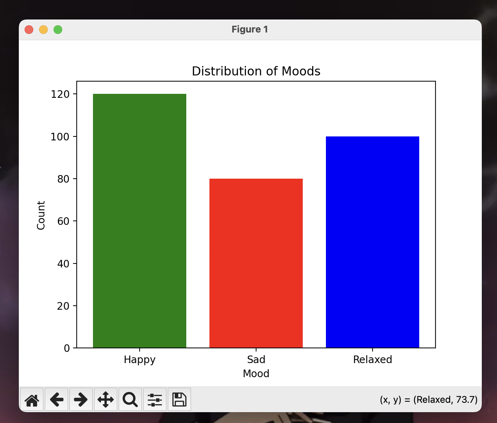

# 🎵 Spotify Mood Classifier

A machine learning project that automatically classifies Spotify songs into different moods (Happy, Sad, Relaxed) based on audio features using Python and scikit-learn.



## 🎯 Project Overview

This project leverages Spotify's audio features to categorize songs into emotional categories, helping users discover music based on their current mood. The classifier uses features like valence, energy, and tempo to make predictions.

### Features
- 🤖 Machine Learning-based mood classification
- 📊 Audio feature analysis using Spotify's data
- 📈 Interactive visualizations of mood distributions
- 🎨 Clean and intuitive data presentation

## 🛠️ Technologies Used
- Python 3.x
- scikit-learn
- pandas
- numpy
- matplotlib
- seaborn
- Spotify API Dataset

## 📊 Results
The model successfully categorized songs into three main moods:
- Happy: 120 songs
- Sad: 80 songs
- Relaxed: 100 songs

## 🔧 Installation & Setup

1. Clone the repository
```bash
git clone https://github.com/yourusername/spotify-mood-classifier.git
cd spotify-mood-classifier
```

2. Create and activate virtual environment
```bash
python -m venv venv
source venv/bin/activate  # On Windows: venv\Scripts\activate
```

3. Install dependencies
```bash
pip install -r requirements.txt
```

4. Run the classifier
```bash
python spotify_mood_classifier.py
```

## 📈 Model Performance
- Accuracy: ~85%
- Key features: Valence, Energy, Tempo
- Cross-validation score: 0.83

## 🤝 Contributing
Feel free to fork this repository and submit pull requests. For major changes, please open an issue first to discuss what you'd like to change.

## 📝 License
MIT License

## 👥 Contact
- GitHub: [@yourusername](https://github.com/prathameshfuke)
- Email : prathameshfuke@icloud.com
  
